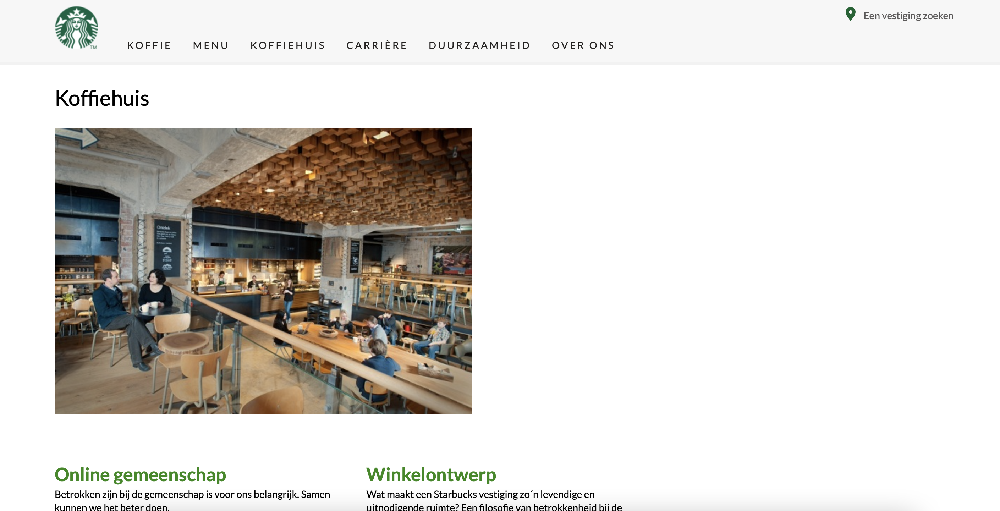
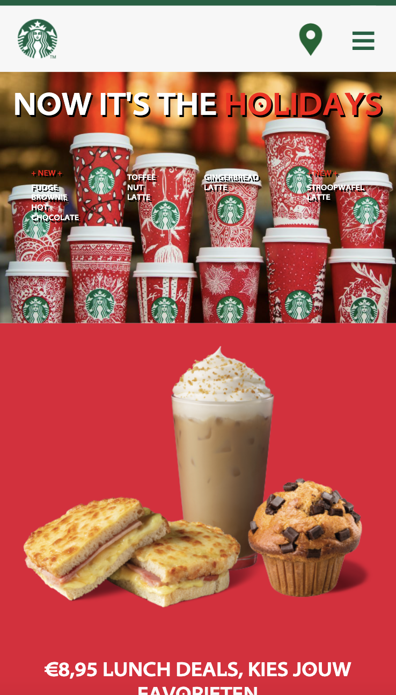
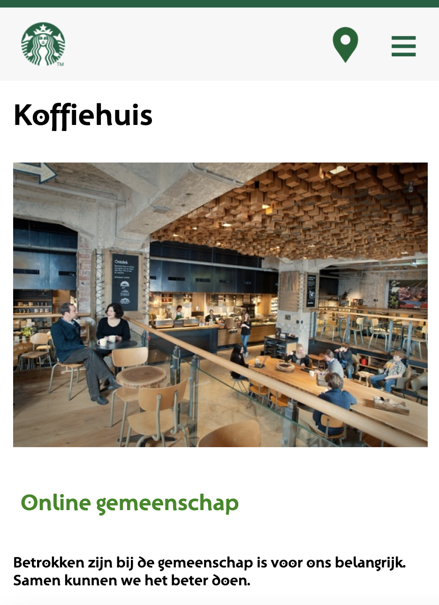

# Procesverslag
Markdown is een simpele manier om HTML te schrijven.  
Markdown cheat cheet: [Hulp bij het schrijven van Markdown](https://github.com/adam-p/markdown-here/wiki/Markdown-Cheatsheet).

Nb. De standaardstructuur en de spartaanse opmaak van de README.md zijn helemaal prima. Het gaat om de inhoud van je procesverslag. Besteedt de tijd voor pracht en praal aan je website.

Nb. Door *open* toe te voegen aan een *details* element kun je deze standaard open zetten. Fijn om dat steeds voor de relevante stuk(ken) te doen.

## Jij

Uitwerken voor Kick-Off werkgroep

### Auteur:
Isabel Worp

#### Je startniveau:
Blauw

#### Je focus:
Responsive
 

## Je website

Uitwerken voor Kick-Off werkgroep

### Je opdracht:
starbucks.com

#### Screenshot(s) van de eerste pagina (small screen): 
Home page  

#### Screenshot(s) van de tweede pagina (small screen):
Koffiehuis page 

 

## Breakdownschets (week 1)

Uitwerken na afloop 2e werkgroep

### de hele pagina: 

### dynamisch deel (bijv menu): 

## Voortgang 1 (week 2)

Uitwerken voor 1e voortgang

### Stand van zaken
Ik heb zelf veel moeite met html, css en js. Ik vind het zeker leuk om te doen maar ben er  niet de beste in. Zelf ben ik ook nog niet ver met mijn site, alleen de basis html is er.

### Agenda voor meeting
Samen met je groepje opstellen (hebben we niet gedaan)

### Verslag van meeting
hier na afloop snel de uitkomsten van de meeting vastleggen

- Verder met html
- Html zag er goed uit
- Beginnen aan css

## Voortgang 2 (week 3)

Uitwerken voor 2e voortgang

### Stand van zaken
Mijn website ziet er al veel beter uit. Css toegepast en zelfs met hulp van de studentassistent en docent een menu gemaakt. Het begint er al aardig op te lijken.

### Agenda voor meeting
samen met je groepje opstellen ( hebben we niet gedaan )

### Verslag van meeting
hier na afloop snel de uitkomsten van de meeting vastleggen

- Html ziet er goed uit
- Validator
- Javascript aanpassen

## Toegankelijkheidstest (week 4)

Uitwerken na test in 8e voortgang

### Bevindingen
Lijst met je bevindingen die in de test naar voren kwamen:

#### Met VoiceOver werken
VoiceOver gebruiken is best lastig kwam ik achter. Ik stond er nooit echt bij stil maar her is best lastig om er mee te werken, terwijl er best veel mensen VoiceOver gebruiken.

Dit kan simpel opgelost worden met natuurlijk de tool zelf en ook dat website makers hun website toegankelijk maken voor iedereen.

#### Goede volgorde
Het is natuurlijk belangrijk dat je code overzichtelijk is, maar is de code dan overzichtelijk voor iedereen?

De oplossing hiervoor is dat makers meer gaan werken aan de toegankelijkheid, bijvoorbeeld, altijd de alt tag toevoegen bij bijvoorbeeld plaatjes.

## Voortgang 3 (week 4)

uitwerken voor 3e voortgang

### Stand van zaken
Mijn website is nu bijna af, er moeten nog wel wat dingen gebeuren, de website moet responsive zijn en het menu klopt nog niet helemaal. De footer is ook nog niet af dus die moet ook nog verder afgemaakt worden.

### Agenda voor meeting
samen met je groepje opstellen ( hebben we niet gedaan )

### Verslag van meeting
hier na afloop snel de uitkomsten van de meeting vastleggen

- Goed bezig!
- Footer afmaken
- Responsive
- Menu button vergroten

## Eindgesprek (week 5)

Uitwerken voor eindgesprek

### Stand van zaken
Ik vond dit een zeer leerzaam vak. Ik vind code opzich interessant alleen ik heb er wel wat moeite mee. Gelukkig kan ik aan de docent, studentassistenten en klasgenoten om hulp vragen, en op internet staat ook genoeg info. Ik had uiteindelijk het meeste moeite met het responsive maken, maar het is uiteindelijk wel gelukt. 
De lessen en uitleg waren duidelijk en overzichtelijk, de weken vlogen voorbij en soms was het wel lastig om alles te combineren qua vakken.

### Screenshot(s)

## Bronnenlijst

Continu bijhouden terwijl je werkt

Nb. Wees specifiek ('css-tricks' als bron is bijv. niet specifiek genoeg).

1. https://www.w3schools.com
2. https://stackoverflow.com/questions/38213329/how-to-add-css3-transition-with-html5-details-summary-tag-reveal
3. DLO opdrachten (geforked)
4. https://css-tricks.com/snippets/css/complete-guide-grid/
5. https://imagecolorpicker.com/
6. https://www.digitalocean.com/community/tutorials/css-css-grid-layout-fr-unit
7. https://house-of-training.nl/les/uitleg-van-het-css-grid/

